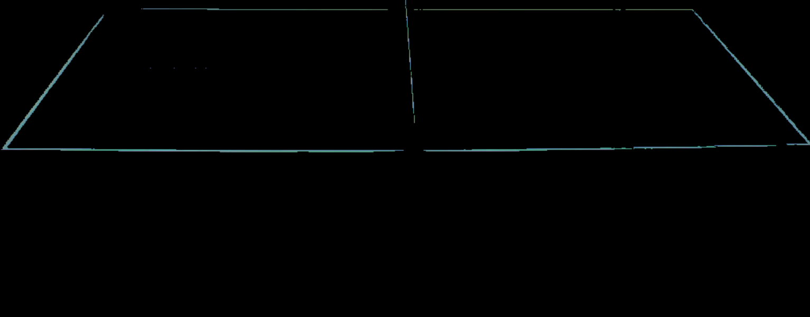
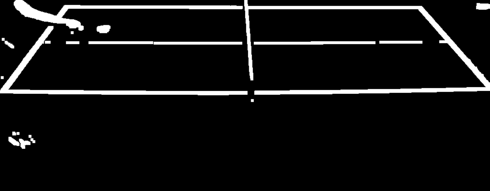
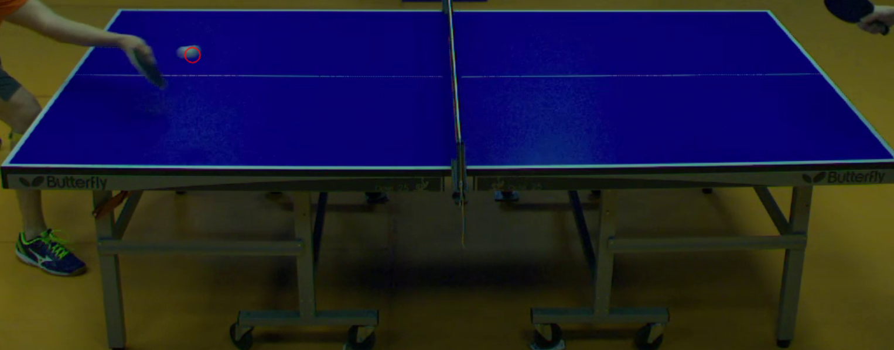
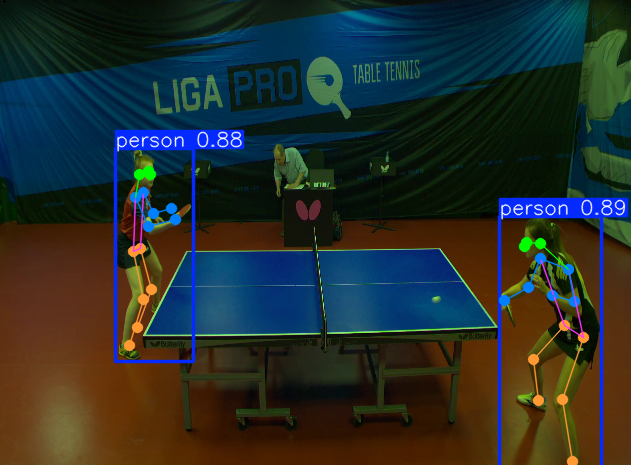

# Table Tennis Deep Learning
 Classify top spin and back spin shots. Videos are taken from the [OpenTTGames](https://lab.osai.ai/) dataset. 

## Procedure

### 1. Determine when a shot has been made

The times of a shot being made is determined when the x-velocity of the ball changes sign. However, the ball is too small and often blends into the background, making the position hard to determine. To solve this, I figured that when a shot is made, the ball must land on the table soon after. So I can just find the position of the ball within the table.

To do so, I first got an image with just the table surface

and I also took the average color of the white objects to get an approximate color of the ball

For each frame of the video, I produce two masks: one for pixels that differ from the table surface image (meaning something is on top of the table)  and one for pixels near the average white that I got (this hopefully filters out the racket and players) . Bitwise and-ing the two masks and I get .

Then I use opencv's blob detector to detect blobs with over 0.7 circularity. Giving us the position of the ball. 

### 2. Manually label each video segment

Using [stroke.py](stroke.py), I watch through every segment that the was marked as a shot and labeled them as one of the following: Forehand topspin, backhand topspin, forehand backspin, backhand backspin, forehand serve, backhand serve, and N/A. 

### 3. Train model to classify shot type

Using YoloV8's keypose model, I get the positions of the player's body parts.
For each player, the model outputs an array with each indices 0-> Nose, 1-> Left Eye, 2-> Right Eye, 3-> Left Ear, 4-> Right Ear, 5-> Left Shoulder, 6-> Right Shoulder, 7-> Left Elbow, 8-> Right Elbow, 9-> Left Wrist, 10-> Right Wrist, 11-> Left Hip, 12-> Right Hip, 13-> Left Knee, 14-> Right Knee, 15-> Left Ankle, 16-> Right Ankle.

The positions are then normalized so that the nose of the player is (0, 0). Only values starting at index 5 are used since face features are not always detected. 

For each shot, 12 frames that span across the second before the shot is used. Since the data is sequential, an LSTM was chosen for classifying the data. 